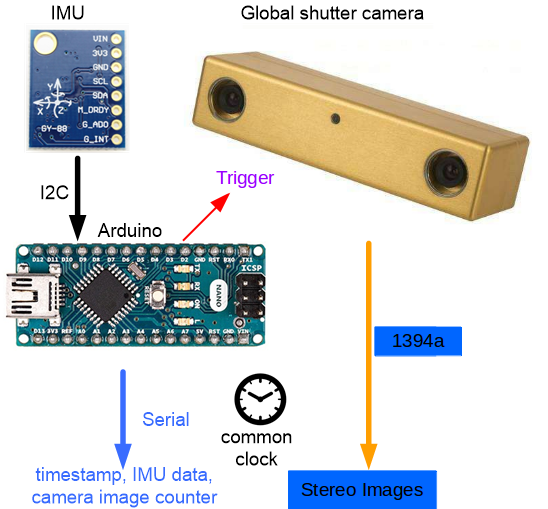
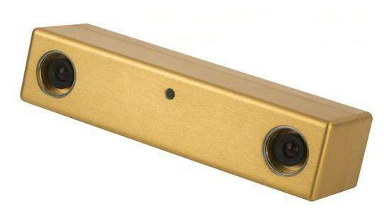
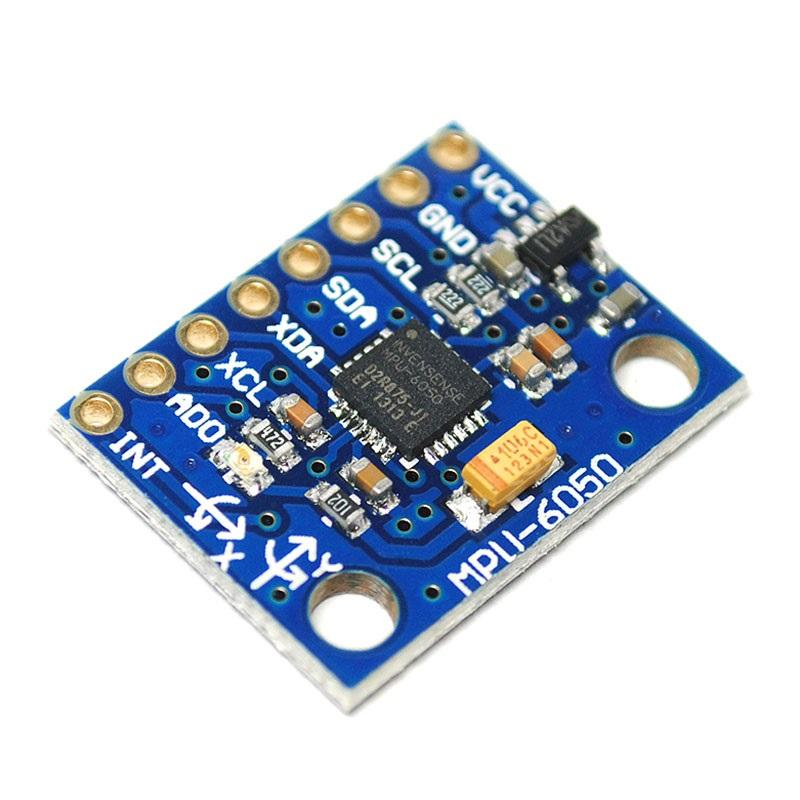
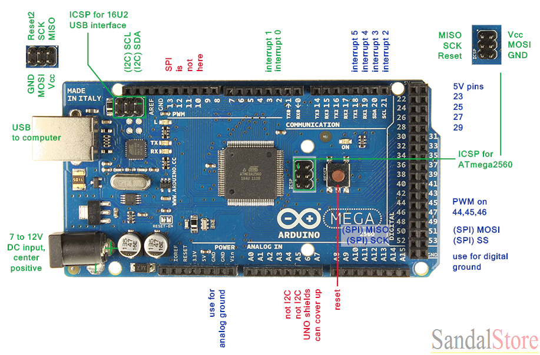

# Visual-Inertial-Synchronization-Hardware

#### Authors: [Xinliang Zhong](www.xinliang-zhong.com)(xinliangzhong@foxmail.com), [Xu Chen](https://github.com/xuchen27)(chenxu@bit.edu.cn)

## 1.Description
This projects aims to hardware-synchronize camera and IMU so that both use the same (millisecond precise) time base. We have tested the code in Ubuntu16.04 (ROS Kinetic).



The Arduino will calculate precise (microsecond) timestamps for each IMU measurement (200 Hz). At certain timestamps (20 Hz), it will trigger the camera (via the trigger line) to capture a new image. Timestamp and triggerCounter data will be sent to the PC (IMU node). The IMU node will receive IMU data from the Arduino and publish the time data via a new ROS TimeReference message (topic /imu/trigger_time). The camera node will subscribe to this time data to reconstruct precise time for each camera image. So, the message flow will be like this:

```
IMU –> Arduino –> PC (ROS IMU node) –> ROS camera node
```

## 2.Requirements

### 2.1 Hardware
In our implementation, we choose **[bumblebee2](https://www.ptgrey.com/bumblebee2-firewire-stereo-vision-camera-systems)** which support **externel trigger **as the stereo visual sensor and **[mpu6050](https://www.invensense.com/products/motion-tracking/6-axis/mpu-6050/)** as the inertial sensor. Below are the details:

| Hardware | Visual Sensor | IMU sensor | Embedded devices |
|--------|--------|--------|--------|
| Name | Bumblebee2 1394a | MPU6050 |Arduino Mega 2560 |
| Description |  |  | |

The wiring diagram of the whole system is shown in figure.
*	Part1: mpu6050 to Arduino
*	Part2: Camera
*	Part3: Whole System

### 2.2 Software
*	ROS Kinetic
*	sudo apt-get install ros-kinetic-serial

## 3.Data Structure
The Arduino will send useful information to the imu node via usb.The structure like this:

|Description|'$'|0x03|quaternion|gyro|acc|temperature|timestamps|triggures|'\r'|'\n'|
|-|--------|--------|
|Bytes|1|1|8|6|6|2|4|4|1|1|
After we send the data to imu_node, we parse the data and reconstruct it as the imu messages:

* **`imu/data`** ([sensor_msgs::Imu])

	The measured accelerometer, gyro and orientation values.

* **`/imu/trigger_time`** ([sensor_msgs::TimeReference])

	The timestamp of image and image sequence.

* **`imu/temperature`** ([sensor_msgs::Temperature])

	The measured temperature in degrees Celsius.

So far, you can use mpu6050_serial_to_imu_node to test the imu data:

```bash
roslaunch mpu6050_serial_to_imu mpu6050.launch
```